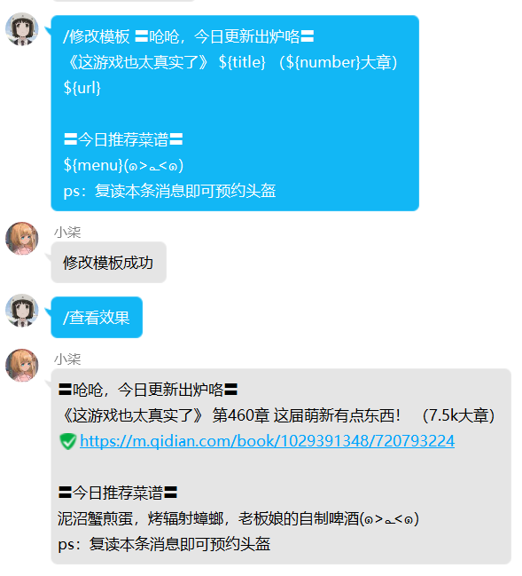
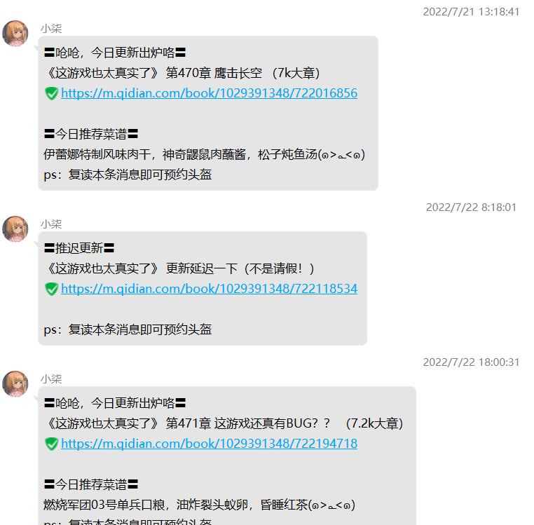
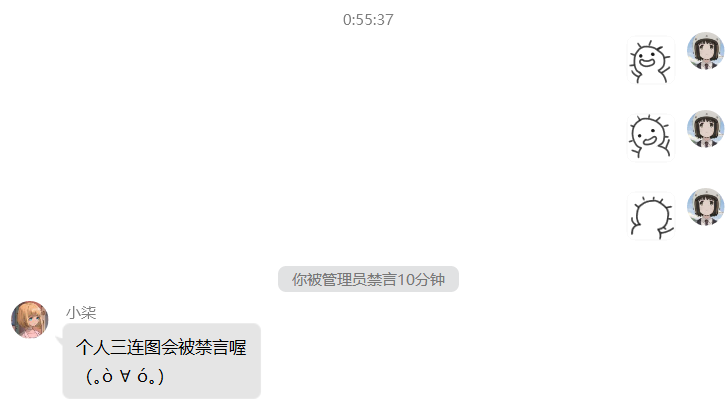
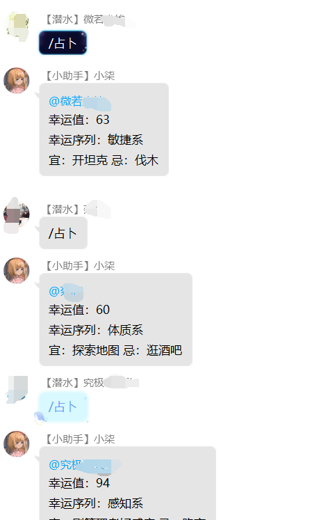
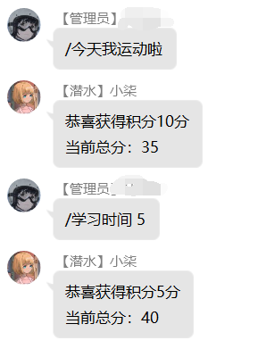

# qq群聊机器人
基于moqqx机器人框架提供的HTTPAPI插件实现机器人功能

框架地址：https://moqqx.cn/

插件地址：https://moqqx.cn/pages/198c35/#%E5%9F%BA%E7%A1%80%E9%85%8D%E7%BD%AE

背景是起点小说《这游戏也太真实了》的运营官想每天能在群里通知小说有更新

我就想到直接用qq机器人根据更新模板自动生成每日更新提醒，并且群发到所有群

## 机器人功能

### 设置更新提示模板，并且查看效果

### 小说更新后自动群发提示

### 根据群主要求，要限制图片刷屏，3连图要被禁言

### 根据群主要求，要限制图片刷屏，5连图要禁言最后两位

### 入群欢迎

### 为了活跃群聊添加的占卜功能，一天只能占卜一次，凌晨12点更新次数

### 还有督促女友学习，给她开的积分系统，由于她积分还不够，没有更多对应的截图

每150分得一张瑞幸咖啡兑换卡

每200分得一张零食兑换卡

每300分得一张蛋糕兑换卡

每600分得一张大餐兑换卡

后续还可能继续更新由运营官结合小说背景设计的文字游戏